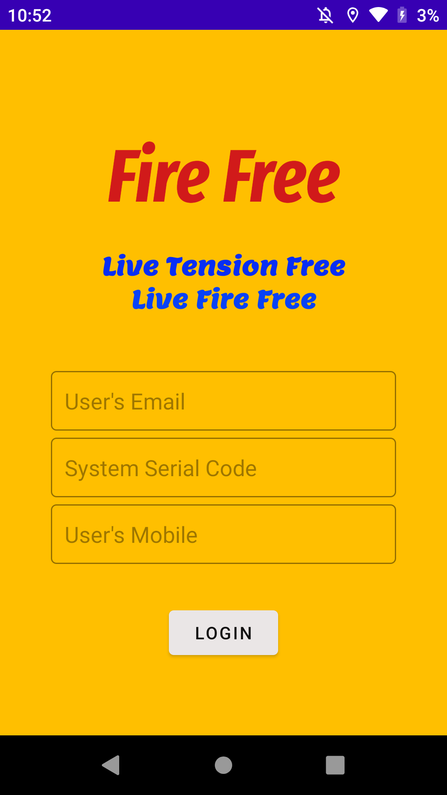
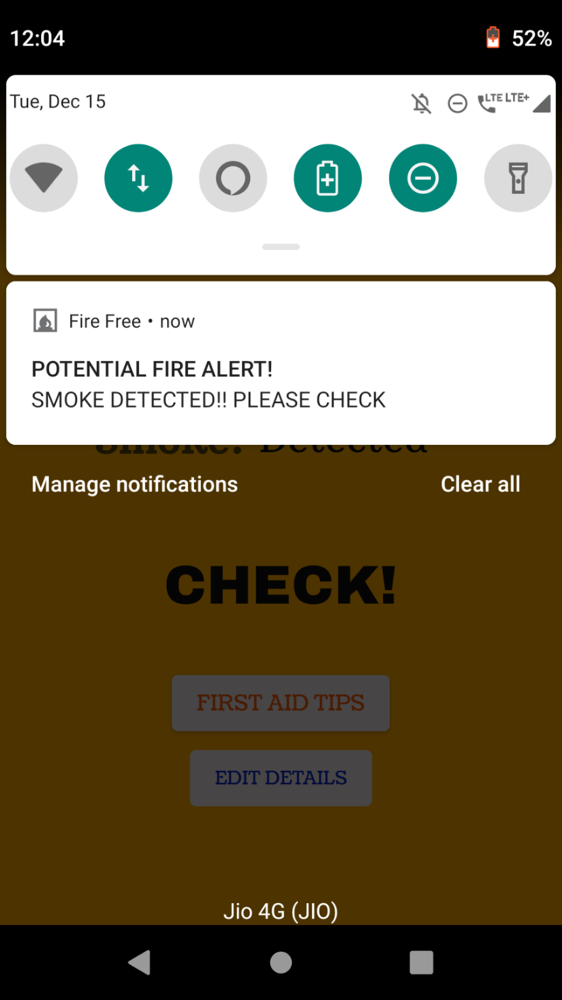
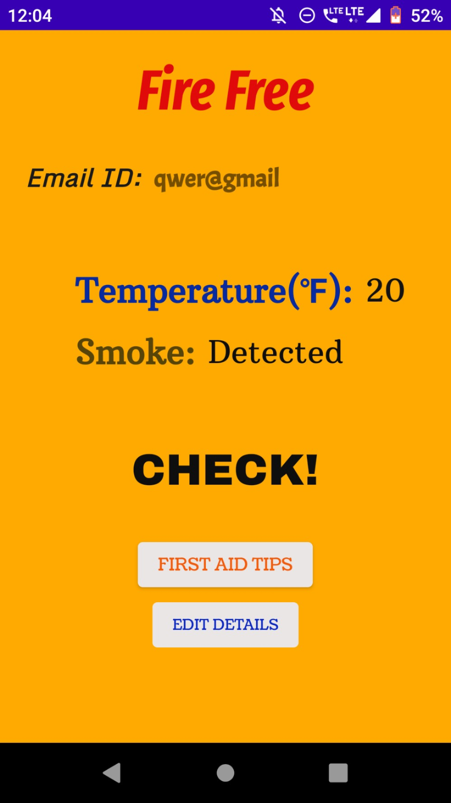

# Fire-Free
##### Android application which constitutes the software part of smart fire alarm system comprising of esp8266. The app let's user see the readings and is alerted of an emergency situation through alarm sound,notification and sms. The app provides the contact number of emergency services along with first aid tips.

###### Programming language used is Java and XML for interface. IDE used is Android Studio.

<table style="width:100%">
  <tr>
    <th></th>
    <th> </th>
    <th></th>
  </tr>
 </table>

